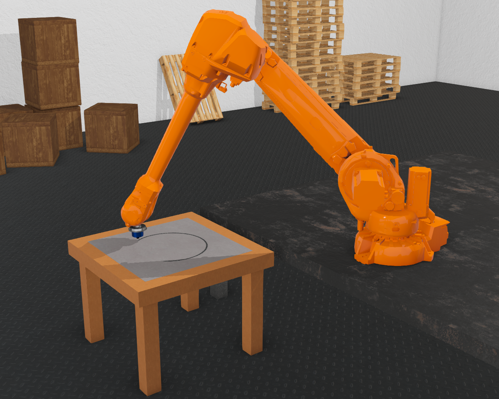

## ABB' IRB 4600/40

%robot irb4600-40 images/robots/irb4600-40/model.png

The [IRB 4600/40](https://new.abb.com/products/robotics/industrial-robots/irb-4600) is a 6 DOF indoor arm developed by [ABB](https://abb.com).
It has a payload of 40kg.

### Movie Presentation


### Irb4600-40 PROTO

Derived from [Solid](../reference/solid.md) and is designed to be inserted in a [Robot](../reference/robot.md) node.

```
PROTO Irb4600-40 [
  SFVec3f    translation  0 0 0
  SFRotation rotation     0 1 0 0
  SFString   name         "IRB 4600/40"
  MFNode     handSlot     []
  SFColor    color        1 0.45 0
]
```

> **File location**: "WEBOTS\_HOME/projects/robots/abb/irb/protos/Irb4600-40.proto"

#### Irb4600-40 Field Summary

- `handSlot`: Extends the arm hand with new nodes.

### "ikpy"

`ikpy` is an inverse kinematics library written in Python.
It can be installed easily using `pip`.
For further details, please refer to [their documentation](https://github.com/Phylliade/ikpy).

### Samples

You will find the following sample in this folder: "WEBOTS\_HOME/projects/robots/abb/irb/worlds".

#### inverse\_kinematics.wbt

 This example demonstrates the use of the `ikpy` Python module.
The `ikpy` chain is hard-coded in the controller.
The arm hand is equipped with a Pen device.
During the first seconds, the robot draws a circle on a paper sheet.
Then the robot hand moves to the target yellow and black object.
If this object is moved, the robot position is updated.
