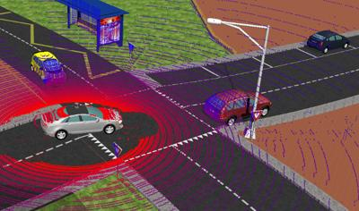
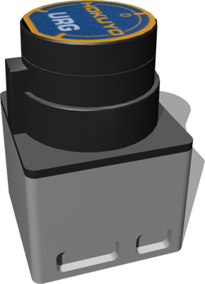
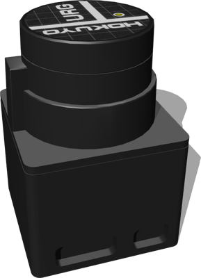
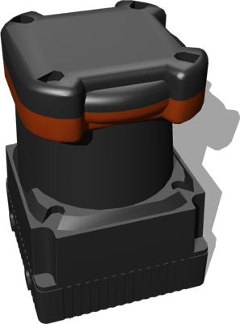
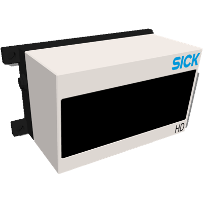
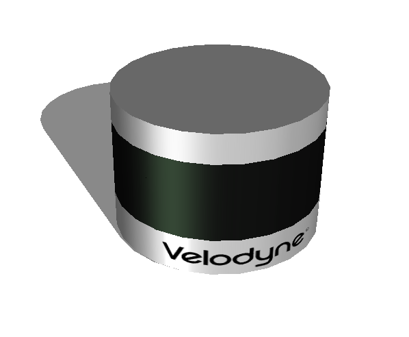
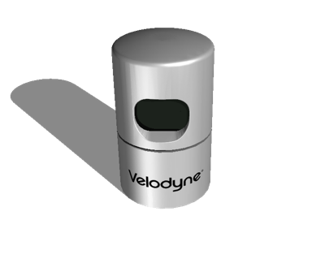
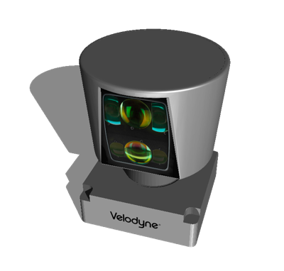

## Lidar Sensors

A wide range of lidar sensors have been modelled.

%figure "Lidar simulation"



%end

### Ibeo LUX

The `Ibeo LUX` is a 4 layers lidar with a range of up to 200 meters and a field of view of up to 110 degrees, it returns 680 points per layer per scan.

The model of the `Ibeo LUX` contains a spherical projection, a fixed resolution of 0.04 meter and a gaussian noise with a standard deviation of 0.1 meter.

%figure "Ibeo LUX lidar"


%end

```
IbeoLux {
  SFVec3f    translation             0 0 0
  SFRotation rotation                0 1 0 0
  SFString   name                    "Ibeo Lux"
  SFBool     useExtendedFieldOfView  FALSE
  SFBool     fastModel               FALSE
}
```

The `IbeoLux` PROTO can either be used in normal field of view mode (80 degrees field of view) or in extended field of view mode (110 degrees field of view) depending on the value of the `useExtendedFieldOfView` field.

The `fastModel` field can be used to simplify the model of the sensor by removing the spherical projection, the noise and the limited resolution in order to speed up the simulation.

### Hokuyo

#### Hokuyo URG-04LX

%figure "Hokuyo URG-04LX model"



%end

The [Hokuyo URG-04LX](https://www.hokuyo-aut.jp/search/single.php?serial=165) is a lidar designed for lightweight indoor robots.
The model has the following specifications:

- `field of view`: 240 [deg]
- `range`: 0.06 to 4.095 [m]
- `resolution`: 667 * 0.36 [deg]
- `dimension`: 0.05 x 0.07 x 0.05 [m]
- `weight`: 0.16 [kg]

```
HokuyoUrg04lx [
  SFVec3f    translation 0 0 0
  SFRotation rotation    0 1 0 0
  SFString   name        "Hokuyo URG-04LX"
  SFFloat    noise       0.0
  SFInt32    resolution  667
]
```

`resolution`: Defines the `horizontalResolution` field of the [Lidar](../reference/lidar.md).

#### Hokuyo URG-04LX-UG01

%figure "Hokuyo URG-04LX-UG01 model"



%end

The [Hokuyo URG-04LX-UG01](https://www.hokuyo-aut.jp/search/single.php?serial=166) is a lidar designed for lightweight indoor robots.
The model has the following specifications:

- `field of view`: 240 [deg]
- `range`: 0.2 to 5.6 [m]
- `resolution`: 667 * 0.36 [deg]
- `dimension`: 0.05 x 0.07 x 0.05 [m]
- `weight`: 0.16 [kg]

```
HokuyoUrg04lxug01 [
  SFVec3f    translation 0 0 0
  SFRotation rotation    0 1 0 0
  SFString   name        "Hokuyo URG-04LX-UG01"
  SFFloat    noise       0.0
  SFInt32    resolution  667
]
```

- `resolution`: Defines the `horizontalResolution` field of the [Lidar](../reference/lidar.md).

#### Hokuyo UTM-30LX

%figure "Hokuyo UTM-30LX model"



%end

The [Hokuyo UTM-30LX](https://www.hokuyo-aut.jp/search/single.php?serial=169) is a lidar designed for outdoor robots with a high moving speed.
The model has the following specifications:

- `field of view`: 270 [deg]
- `range`: 0.1 to 30 [m]
- `resolution`: 1080 * 0.25 [deg]
- `dimension`: 0.06 x 0.087 x 0.06 [m]
- `weight`: 0.37 [kg]

```
HokuyoUtm30lx {
  SFVec3f    translation 0 0 0
  SFRotation rotation    0 1 0 0
  SFString   name        "Hokuyo UTM-30LX"
  SFFloat    noise       0.0
  SFInt32    resolution  1080
}
```

- `resolution`: Defines the `horizontalResolution` field of the [Lidar](../reference/lidar.md).

### SICK

#### SICK LMS 291

The `SICK LMS 291` is a 1 layer lidar with a range of up to 80 meters and a field of view of up to 180 degrees.

The model of the `SICK LMS 291` contains a spherical projection, a configurable fixed resolution and a configurable gaussian noise.

%figure "SICK LMS 291 lidar"


%end

```
SickLms291 {
  SFVec3f    translation 0 0 0
  SFRotation rotation    0 1 0 0
  SFString   name        "Sick LMS 291"
  SFFloat    noise       0.0
  SFInt32    resolution  180
}
```

The `noise` field specifies the standard deviation of the gaussian depth noise in meters.

The `resolution` field specifies the number of points returned per layer per scan.

#### SICK LD-MRS

The [SICK LD-MRS](https://www.sick.com/us/en/detection-and-ranging-solutions/3d-lidar-sensors/ld-mrs/c/g91913) is a multi-layer lidar designed for harsh outdoor environments.
It has a range of 300 meters.

Other parameters depends on its type:

| Type | Number of measurement layers (L) | Horizontal field of view | Horizontal Offset | Vertical field of View |
| --- | --- | --- | --- | --- |
| `400001` | 2 or 4 | 85° (4L) or 110° (2L) | 9.5° (4L) or 5° (2L) | 3.2° |
| `400102` | 2 or 4 | 85° (4L) or 110° (2L) | 9.5° (4L) or 5° (2L) | 3.2° |
| `400001S01` | 2 or 4 | 85° (4L) or 110° (2L) | 9.5° (4L) or 5° (2L) | 3.2° |
| `400102S01` | 2 or 4 | 85° (4L) or 110° (2L) | 9.5° (4L) or 5° (2L) | 3.2° |
| `800001S01` | 4 or 8 | 85° (8L) or 110° (4L) | 9.5° (8L) or 5° (4L) | 6.4° |

Layer 0 corresponds to the bottom layer.
First response values are corresponding to the device right.

%figure "SICK LD-MRS lidar"



%end

```
SickLdMrs {
  SFVec3f    translation       0 0 0
  SFRotation rotation          0 1 0 0
  SFString   name              "Sick LD-MRS"
  SFString   type              "400001"
  SFInt32    measurementLayers 4
  SFString   angularResolution "0.5 [deg]"
  SFFloat    noise             0.001
  SFBool     physics           TRUE
}
```

The `type` field specifies the `SICK LD-MRS` type (cf. [specifications](https://www.sick.com/us/en/detection-and-ranging-solutions/3d-lidar-sensors/ld-mrs/c/g91913)).
Internal parameters are affected by the `type` as described in the table above.
The value could be one of the following: `400001`, `400102`, `400001S01`, `400102S01` or `800001S01`.

The `noise` field specifies the standard deviation of gaussian image noise in meters.

The `measurementLayers` field specifies the number of horizontal layers.
Depending on `SickLdMrs.type` some `measurementLayers` values may not be applicable.
The value could be one of the following: `2`, `4` or `8`.

The `angularResolution` field specifies the vertical angular gap between two measurements.
From the `SICK LD-MRS` specification, it can be either 0.5, 0.25 or 0.125 degrees.
Internally, the `Lidar.horizontalResolution` is directly affected by this field.
The value could be one of the following: `0.5 [deg]`, `0.25 [deg]` or `0.125 [deg]`.

The `physics` field specifies if the sensor should be affected by physics (mass = 1 [kg]) or not.

### Velodyne

All the models of velodyne sensors are available.

#### Velodyne Puck

The `Velodyne Puck` is a 16 layers lidar with a range of up to 100 meters and a field of view of 360 degrees, it returns 3600 points per layer per scan. The `Velodyne Puck` comes in 3 different versions (selectable with the ` version`):
  - **Puck**: Default version (also known as the Velodyne VLP-16).
  - **Puck LITE**: Lighter weight version of the PUCK (590gr instead of 830gr).
  - **Puck Hi-Res**: Version with a 20° vertical FoV for a tighter layer distribution (1.33° between layers instead of 2.00°).

The model of the `Velodyne Puck` contains a spherical projection and a gaussian noise with a standard deviation of 0.03 meter.

%figure "Velodyne Puck model"



%end

```
VelodynePuck {
  SFVec3f    translation    0 0 0
  SFRotation rotation       0 1 0 0
  SFString   name           "Velodyne VLP-16"
  SFString   version        "Puck"
  SFBool     enablePhysics  TRUE
}
```

#### Velodyne HDL 32E

The `Velodyne HDL 32E` is a 32 layers lidar with a range of up to 70 meters and a field of view of 360 degrees, it returns 4500 points per layer per scan.

The model of the `Velodyne HDL 32` contains a gaussian noise with a standard deviation of 0.02 meter and a rotating head.

%figure "Velodyne HDL 32E lidar"



%end

```
VelodyneHDL-32E {
  SFVec3f    translation    0 0 0
  SFRotation rotation       0 1 0 0
  SFString   name           "Velodyne HDL-32E"
  SFBool     enablePhysics  TRUE
}
```

#### Velodyne HDL 64E

The `Velodyne HDL 64E` is a 64 layers lidar with a range of up to 120 meters and a field of view of 360 degrees, it returns 4500 points per layer per scan.

The model of the `Velodyne HDL 64` contains a gaussian noise with a standard deviation of 0.02 meter and a rotating head.

%figure "Velodyne HDL 64E lidar"



%end

```
VelodyneHDL-64E {
  SFVec3f    translation    0 0 0
  SFRotation rotation       0 1 0 0
  SFString   name           "Velodyne HDL-32E"
  SFBool     enablePhysics  TRUE
}
```
