## How To

This section gives various examples of complex behaviors and/or functionalities.
The world files are located in the "[WEBOTS\_HOME/projects/samples/howto/worlds](https://github.com/omichel/webots/tree/master/projects/samples/howto/worlds/)" directory, and their controllers in the "[WEBOTS\_HOME/projects/samples/howto/controllers](https://github.com/omichel/webots/tree/master/projects/samples/howto/controllers/)" directory.
For each, the world file and its corresponding controller are named according to the behavior they exemplify.

### [asymmetric\_friction1.wbt](https://github.com/omichel/webots/tree/master/projects/samples/howto/worlds/asymmetric_friction1.wbt)

**Keywords**: [ContactProperties](../reference/contactproperties.md), asymmetric friction

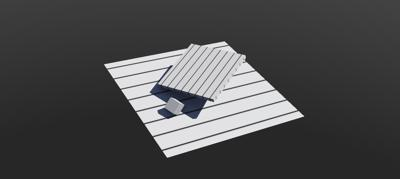 This example shows the setup of asymmetric friction between two solids.
A small box slides on two leaning fixed boxes.
Each of the boxes are striped with black lines.
There is a smaller friction along the black lines, therefore the box is sliding along the black lines.

### [asymmetric\_friction2.wbt](https://github.com/omichel/webots/tree/master/projects/samples/howto/worlds/asymmetric_friction2.wbt)

**Keywords**: [ContactProperties](../reference/contactproperties.md), asymmetric friction

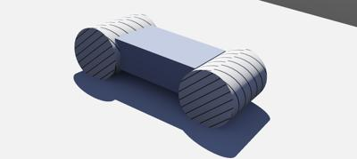 This example shows the setup of asymmetric friction between two solids.
A solid composed of two cylinders is sliding down a leaning plane.
The black strips on the cylinders indicate the friction direction: there is smaller friction along the black lines.
Rotate the solid to modify its speed.

### [binocular.wbt](https://github.com/omichel/webots/tree/master/projects/samples/howto/worlds/binocular.wbt)

**Keywords**: [Camera](../reference/camera.md), stereovision, stereoscopic cameras

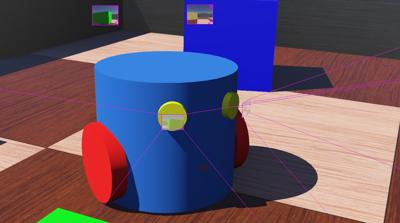 This example simply shows the use of two [Cameras](../reference/camera.md) for stereovision.
The example does not actually perform stereovision or any form of computer vision.

### [biped.wbt](https://github.com/omichel/webots/tree/master/projects/samples/howto/worlds/biped.wbt)

**Keywords**: Humanoid robot, biped robot, power off, passive joint

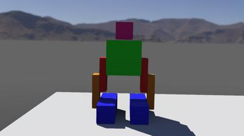 In this example, a biped robot stands up while his head rotates.
After a few seconds, all the motors are turned off and the robot collapses.
This example illustrates the build of a simple articulated robot and also how to turn off motor power.

### [center\_of\_mass.wbt](https://github.com/omichel/webots/tree/master/projects/samples/howto/worlds/center_of_mass.wbt)

**Keywords**: Center of mass

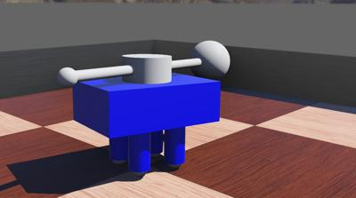 In this example, a light robot rotates a heavy mass.
The inertia of the heavy mass lets the robot base turn round.
The overall center of mass of the robot is changing.
This can be visualized with the `View / Optional Rendering / Show Center of Mass...` or `mass` tab of in the node editor when the robot is selected.

### [custom\_html\_robot\_window.wbt](https://github.com/omichel/webots/tree/master/projects/samples/howto/worlds/custom_html_robot_window.wbt)

**Keywords**: custom robot window, [controller plugin](controller-plugin.md), HTML, Javascript, CSS

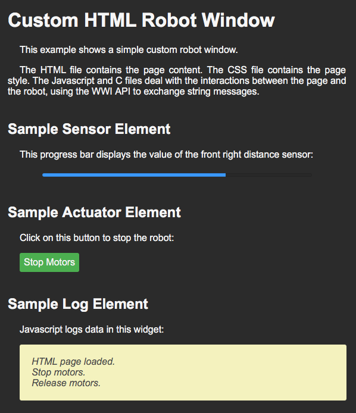 This example shows a simple custom robot window.
The HTML file contains the page content.
The CSS file contains the page style.
The Javascript and C files deal with the interactions between the page and the robot, using the WWI API to exchange string messages.

### [cylinder\_stack.wbt](https://github.com/omichel/webots/tree/master/projects/samples/howto/worlds/cylinder_stack.wbt)

**Keywords**: [Supervisor](../reference/supervisor.md), contact points, cylinder collisions

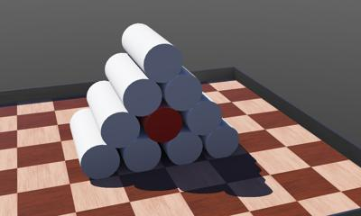 In this example, a stack of cylinders collapses.
A [Supervisor](../reference/supervisor.md) controller gets information on the contact points and displays the reaction forces in the `Console`.

### [force\_control.wbt](https://github.com/omichel/webots/tree/master/projects/samples/howto/worlds/force_control.wbt)

**Keywords**: Force control, linear motor, spring and damper

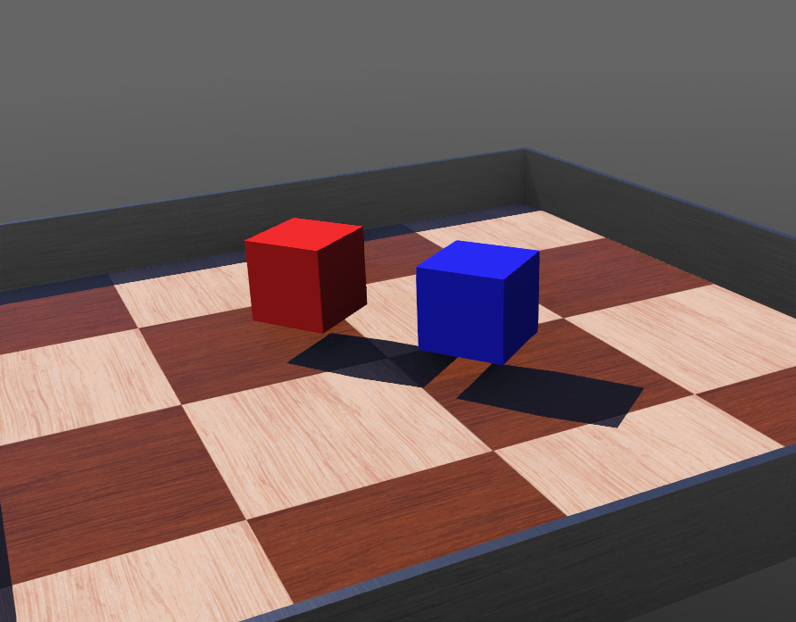 This world shows two boxes connected by a [LinearMotor](../reference/linearmotor.md).
Here, the purpose is to demonstrate the usage of the `wb_motor_set_force` function to control a [LinearMotor](../reference/linearmotor.md) with a user specified force.
In this example, the `wb_motor_set_force` function is used to simulate the effect of a spring and a damper between the two boxes.
When the simulation starts, the motor force is used to move the boxes apart.
Then, the motor force is turned off and the boxes oscillate for a while, according to the spring and damping equations programmed in the controller.

### [four\_wheels.wbt](https://github.com/omichel/webots/tree/master/projects/samples/howto/worlds/four_wheels.wbt)

**Keywords**: four-wheeled frame

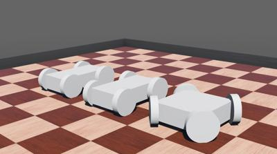 This example shows three models of four-wheeled vehicles.
In the first layout, the four motorized wheels are positioned circularly, as could be done for omnidirectional-wheeled robots.
In the second layout, the four motorized wheels are oriented in the same direction, as could be done for a robot with tracks.
In the third layout, a simple [Ackermann steering geometry](https://en.wikipedia.org/wiki/Ackermann_steering_geometry) is shown.
Note that more completed Ackermann steering geometry can be achieved using the [`AckermannVehicle` PROTO](../automobile/ackermannvehicle.md), and the [`car` library](../automobile/car-library.md).

### [gui\_tracker.wbt](https://github.com/omichel/webots/tree/master/projects/samples/howto/worlds/gui_tracker.wbt)

**Keywords**: GUI, custom Qt-based robot window

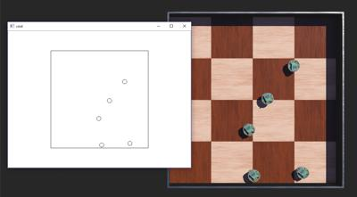 This example shows the use of the deprecated Qt-based system to create custom windows.
A [Supervisor](../reference/supervisor.md) controller is getting the position of five e-pucks moving randomly, and this information is sent to the custom robot window plugin called `tracking window`.
This window is based on Qt (embedded in Webots) and the `Qt utils` helper library.

> **Note**: Please refer to [the HTML robot window example](#custom_html_robot_window-wbt) instead.

### [inverted\_pendulum.wbt](https://github.com/omichel/webots/tree/master/projects/samples/howto/worlds/inverted_pendulum.wbt)

**Keywords**: Inverted pendulum, PID, [LinearMotor](../reference/linearmotor.md)

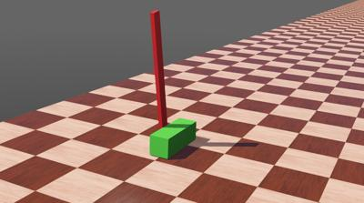 In this example, a robot moves from left to right in order to keep an inverted pendulum upright.
This is known as the "Inverted Pendulum Problem", and it is solved in our example by using a PID (Proportional Integral Differential) controller.

### [mouse\_events.wbt](https://github.com/omichel/webots/tree/master/projects/samples/howto/worlds/mouse_events.wbt)

**Keywords**: Mouse events, user input

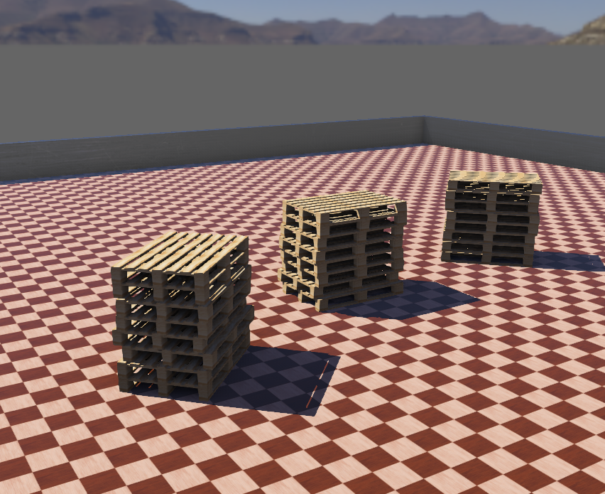 This example shows the use of the [Supervisor API](../reference/supervisor.md) to retrieve mouse events.
When the simulation is running, the [Supervisor](../reference/supervisor.md) controller called `mouse_events.c` waits for a mouse event and displays in the `Console` the 3D and 2D coordinates of the mouse and the name of the hit object.
The controller of this simulation is blocking, which means it will block until a mouse click is detected and it will not advance the simulation time.
An alternative non blocking controller called `mouse_events_non_blocking.c` is also available for this example.

### [omni\_wheels.wbt](https://github.com/omichel/webots/tree/master/projects/samples/howto/worlds/omni_wheels.wbt)

**Keywords**: Omnidirectional wheels

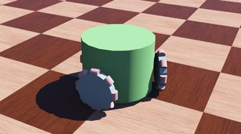 This example shows an omnidirectional wheel model.
In this example, the omnidirectional wheels are modeled with two layers of joints and cylinders solids.
Faster omnidirectional wheels implementations could be achieved using asymmetric friction (cf. `Youbot` model).

### [passive\_dynamic\_walker.wbt](https://github.com/omichel/webots/tree/master/projects/samples/howto/worlds/passive_dynamic_walker.wbt)

**Keywords**: Passive dynamic walker

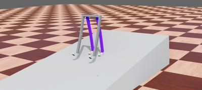 This example shows a passive dynamic walker model.
This biped robot is not motorized.
It goes down the slope with a smooth motion simply because of its shape and its potential energy.

### [pedal\_racer.wbt](https://github.com/omichel/webots/tree/master/projects/samples/howto/worlds/pedal_racer.wbt)

**Keywords**: Pedal racer, apply a force, mechanical loop, [SolidReference](../reference/solidreference.md)

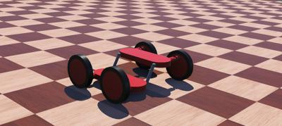 This example shows the mouse interaction with a complex model.
You can apply a force to the pedals using `Alt + mouse left click.`.

### [physics.wbt](https://github.com/omichel/webots/tree/master/projects/samples/howto/worlds/physics.wbt)

**Keywords**: [Physics plugin](../reference/physics-plugin.md), OpenGL drawing, flying robot, [Emitter](../reference/emitter.md), [Receiver](../reference/receiver.md)

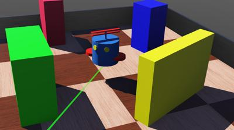 In this example, a robot flies using a physics plugin.
This plugins is an example of:

- How to access Webots objects in the physics plugin.
- How to exchange information with the controller.
- How to add custom forces.
- How to move objects.
- How to handle collisions.

### [rope.wbt](https://github.com/omichel/webots/tree/master/projects/samples/howto/worlds/rope.wbt)

**Keywords**: [BallJoint](../reference/balljoint.md), rope

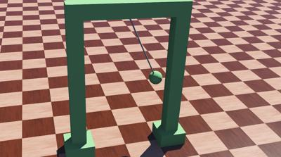 In this example, a rope is simulated.
The rope is composed of several discrete rigid cylinders attached using ball joints.

### [sick\_terrain\_scanning.wbt](https://github.com/omichel/webots/tree/master/projects/samples/howto/worlds/sick_terrain_scanning.wbt)

**Keywords**: [Lidar](../reference/lidar.md), Sick, scanning

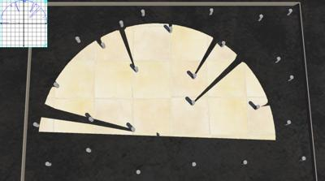 In this example, a Pioneer 3AT mounted with a Sick LMS 291 is scanning its environment.
Each lidar scan is displayed in a [Display](../reference/display.md) device.
A [Supervisor](../reference/supervisor.md) controller applies the scan depth output by removing pixels on a black texture which is applied on the ground.

### [spinning\_top.wbt](https://github.com/omichel/webots/tree/master/projects/samples/howto/worlds/spinning_top.wbt)

**Keywords**: Spinner, chessboard, chess pieces, apply a torque

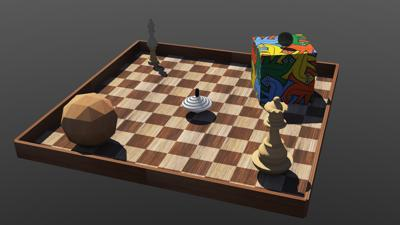 This example shows rotating objects, in order to play with the torque application feature.
To apply a torque on the spinner, use the `Alt + mouse right click` sequence.

### [supervisor\_draw\_trail.wbt](https://github.com/omichel/webots/tree/master/projects/samples/howto/worlds/supervisor_draw_trail.wbt)

**Keywords**: [Supervisor](../reference/supervisor.md), [IndexedLineSet](../reference/indexedlineset.md), draw trail

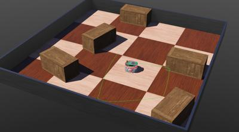 In this example, a [Supervisor](../reference/supervisor.md) controller draws a green path behind a target node.
The target node is a [Transform](../reference/transform.md) node mounted in the `turretSlot` of a moving e-puck robot.
At the beginning of the simulation, the [Supervisor](../reference/supervisor.md) controller creates programmatically an `IndexedLineSet` node.
Then at each simulation step, it uses the target node position to update the `IndexedLineSet` node fields.

### [texture\_change.wbt](https://github.com/omichel/webots/tree/master/projects/samples/howto/worlds/texture_change.wbt)

**Keywords**: [Supervisor](../reference/supervisor.md), texture, `wb_supervisor_field_set_*` functions, [Camera](../reference/camera.md)

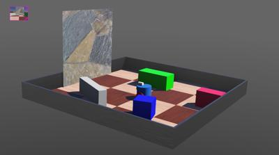 In this example, a robot moves forward and backward in front of a large textured panel.
The robot watches the panel with its [Camera](../reference/camera.md).
Meanwhile a [Supervisor](../reference/supervisor.md) controller switches the image displayed on the panel.

### [vision.wbt](https://github.com/omichel/webots/tree/master/projects/samples/howto/worlds/vision.wbt)

**Keywords**: [OpenCV](https://opencv.org), color filter

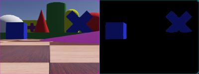 This example demonstrates the use of [OpenCV](https://opencv.org/) to process the camera image.
The robot acquires images from a colored scene.
The controller is linked with OpenCV (embedded in Webots).
The [Camera](../reference/camera.md) image is given to OpenCV, OpenCV filters are applied on the image, and the result is displayed in a [Display](../reference/display.md) overlay.

### [ziegler\_nichols.wbt](https://github.com/omichel/webots/tree/master/projects/samples/howto/worlds/ziegler_nichols.wbt)

**Keywords**: PID control, Ziegler-Nichols method, plot

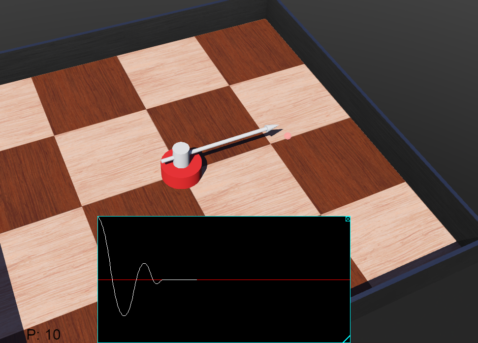 This example shows the use of the `wb_motor_set_pid` function.
It adapts its PID parameters as specified by the [Ziegler-Nichols tuning method](https://en.wikipedia.org/wiki/Ziegler%E2%80%93Nichols_method).
Each P-controller is tested during a period of 400 time steps, i.e. 12.8 seconds.
A P-controller 'succeeds' if a constant error amplitude repeats at least 10 times during the test period.
Otherwise the proportional gain P is incremented by 10 and the experiment restarts.
The tuned Ziegler-Nichols "ultimate" gains will be computed for the first successful controller.
The result is plot in a [Display](../reference/display.md) overlay.
