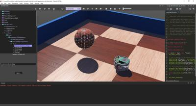

## Tutorial 3: Appearance (20 Minutes)

The aim of this tutorial is to familiarize yourself with some nodes related to the graphical rendering.
Good looking simulations can be created very quickly when these nodes are used adequately.
A good graphics quality does not only enhance the user's experience, it is also essential for simulations where robots perceive their environment (camera image processing, line following, etc.).

The result at the end of this tutorial is shown in [this figure](#simulation-after-having-setup-the-light-and-the-pbrappearance-nodes).

### New Simulation

> **Hands-on #1**: From the results of the previous tutorial, create a new simulation called "appearance.wbt" by using the `File / Save World As...` menu.

### Lights

The lighting of a world is determined by [Light](../reference/light.md) nodes and the [Background](../reference/background.md) .
There are three types of light nodes: the [DirectionalLight](../reference/directionallight.md), the [PointLight](../reference/pointlight.md) and the [SpotLight](../reference/spotlight.md).
A [DirectionalLight](../reference/directionallight.md) simulates a light which is infinitely far (ex: the sun), a [PointLight](../reference/pointlight.md) simulates light emitted from a single point (ex: a light bulb), and a [SpotLight](../reference/spotlight.md) simulates a conical light (ex: a flashlight).
[This figure](#comparison-of-the-three-lighting-possible-in-webots-left-directionallight-middle-spotlight-and-right-pointlight) shows a comparison between them.
Each type of light node can cast shadows.
You can find their complete documentation in the [Reference Manual](../reference/nodes-and-api-functions.md).

%figure "Comparison of the three lighting possible in Webots. Left DirectionalLight, middle SpotLight and right PointLight."

%end

Lights are costly in term of performance and reduce the simulation speed (especially when they cast shadows).
Minimizing the number of lights increases the rendering speed.
A [PointLight](../reference/pointlight.md) is more efficient than a [SpotLight](../reference/spotlight.md), but less than a [DirectionalLight](../reference/directionallight.md).

In this simulation, the [Light](../reference/light.md) node is not visible in the scene tree because it is contained in the [TexturedBackgroundLight](object-backgrounds.md#texturedbackgroundlight) PROTO node.
It consists of a [DirectionalLight](../reference/directionallight.md) whose intensity and direction is computed automatically according to the background of the scene.

### Modify the Appearance of the Walls

The aim of this subsection is to color the walls in blue.

The [Appearance](../reference/appearance.md) and [PBRAppearance](../reference/pbrappearance.md) nodes of the [Shape](../reference/shape.md) node determine the graphical appearance of the object.
Among other things, these nodes are responsible for the color and texture of objects.

Prefer [PBRAppearances](../reference/pbrappearance.md) for a better rendering as shown in the following comparison.

%figure "Comparison between Appearance node (left) and PBRAppearance node (right)."

%end

> **Hands-on #2**: In the [Shape](../reference/shape.md) node representing graphically the first wall, add a [PBRAppearance](../reference/pbrappearance.md) node to the `appearance` field.
1. Set its `baseColor` field to blue using the color selector.
2. Set its `metalness` field to 0 using the field editor.
3. Finally, set its `roughness` field to 0.5 using the field editor.
4. If the DEF-USE mechanism of the previous tutorial has been correctly implemented, all the walls should turn blue.

### Add a Texture to the Ball

The aim of this subsection is to apply a texture on the ball.
A texture on a rolling object can help to appreciate its movement.

> **Hands-on #3**: Similarly add a [PBRAppearance](../reference/pbrappearance.md) node to the ball.
1. As before, set the `metalness` field to 0 and the `roughness` field to 1.
2. Add an [ImageTexture](../reference/imagetexture.md) node to the `baseColorMap` field of the [PBRAppearance](../reference/pbrappearance.md) node.
3. Add an item to the [ImageTexture](../reference/imagetexture.md)'s `url` field using the `Add` button.
4. Then set the value of the newly added `url` item using the "Select" button.
5. Follow the path "[WEBOTS\_HOME/projects/default/worlds/textures/red\_brick\_wall.jpg](https://github.com/cyberbotics/webots/tree/master/projects/default/worlds/textures/red_brick_wall.jpg)". Normally it should be "usr/local/webots/projects/default/worlds/textures/red\_brick\_wall.jpg".

The texture URLs must be defined either relative to the `worlds` directory of your project directory or relative to the default project directory [`WEBOTS_HOME/projects/default/worlds`](https://github.com/cyberbotics/webots/tree/master/projects/default/worlds).
In the default project directory you will find textures that are available for every world.

Open the `red_brick_wall.jpg` texture in an image viewer while you observe how it is mapped onto the [Sphere](../reference/sphere.md) node in Webots.

Textures are mapped onto Geometry nodes according to predefined **UV mapping** functions described in the [Reference Manual](../reference/imagetexture.md).
A UV mapping function maps a 2D image representation to a 3D model.

%figure "Simulation after having setup the Light and the `PBRAppearance` nodes."

%end

### Rendering Options

Webots offers several rendering modes available in the `View` menu.

> **Hands-on #4**: View the simulation in wireframe mode by using the `View / Wireframe Rendering` menu item.
Then restore the plain rendering mode: `View / Plain Rendering`.

Others rendering features can be helpful:
- View Coordinates systems: `View / Optional Rendering / Show Coordinates System (Ctrl + F1)`.
- View distance sensor rays: `View / Optional Rendering / Show DistanceSensor Rays (Ctrl + F10)`.

### Solution: World File

To compare your world with the solution, go to your files and find the folder named "my\_first\_simulation" created in [Tutorial 1](tutorial-1-your-first-simulation-in-webots.md), then go to the "worlds" folder and open with a text editor the right world.
[This solution](https://github.com/cyberbotics/webots/blob/master/projects/samples/tutorials/worlds/appearance.wbt) as the others is located in the [solution directory](https://github.com/cyberbotics/webots/blob/master/projects/samples/tutorials/worlds/).

### Conclusion

In this tutorial, you have learned how to set up a good looking environment using the [PBRAppearance](../reference/pbrappearance.md) node and the light nodes.

You can go further on this topic by reading the detailed description of these nodes in the `Reference Manual`.
This [section](modeling.md#how-to-get-a-realisitc-and-efficient-rendering) will give you a method to efficiently setup these nodes.
