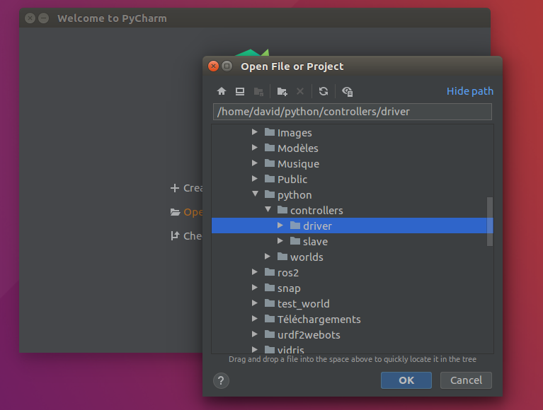
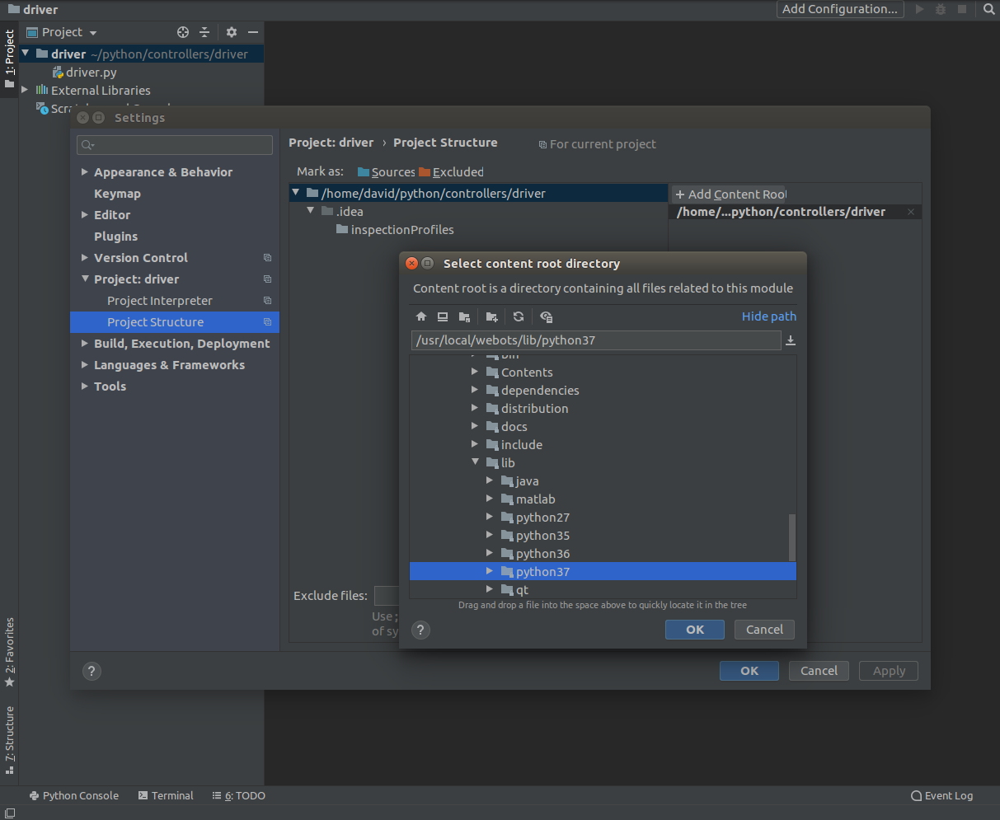
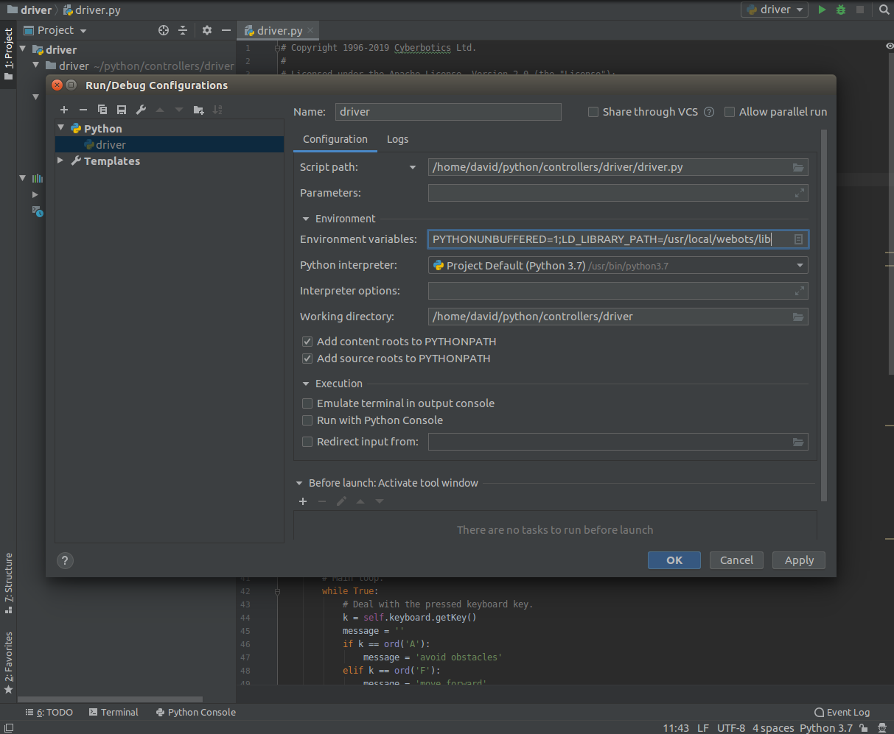
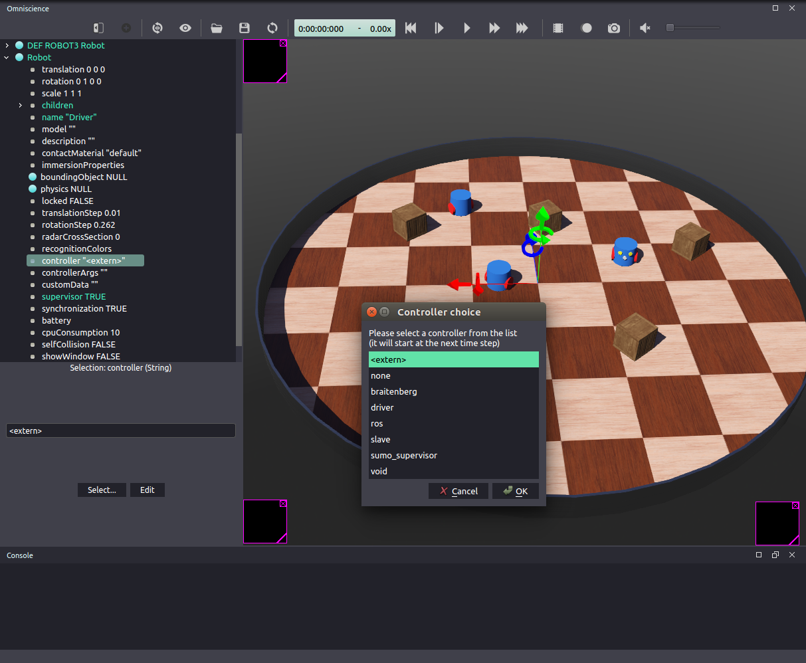
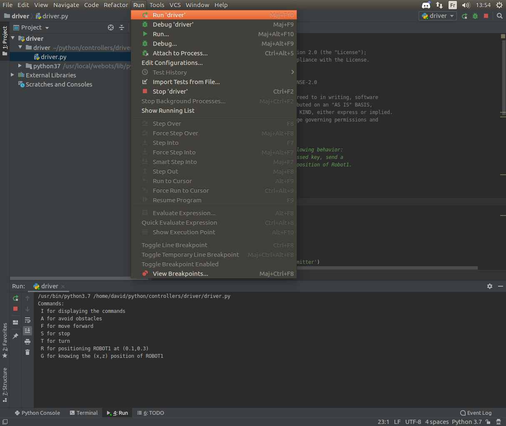

## Using PyCharm with Webots

### Introduction

[PyCharm](https://www.jetbrains.com/pycharm) is a cross-platform integrated development environment (IDE), specifically for the Python language.
It provides code analysis, a graphical debugger, an integrated unit tester and integration with version control systems (VCSes).

[PyCharm](https://www.jetbrains.com/pycharm) is a possible alternative to using Webots built-in editor for Python.
This chapter will explain step by step how to configure [PyCharm](https://www.jetbrains.com/pycharm) to edit a Python controller and then run it.
Although this chapter focuses on [PyCharm](https://www.jetbrains.com/pycharm), similar procedure should be valid for other Python IDE.

### Creation of the PyCharm Project

Once PyCharm start, select `Open` and then select the directory of the controller that you want to modify.
As an example the `driver` sample controller is used here.

%figure "Open controller in PyCharm"

%end

In order to use the Webots Python API, it should be added to the project.
This can be done from the `File` / `Settings` menu.
In the `Settings` window, select the `Project` / `Project Structure` tab, then, the `Add Content Root` can be used to add a new folder to the path, select the `WEBOTS_HOME/lib/python37` folder (or any other Python version).

%figure "Addition of the Webots controller library"

%end

The Webots Python API depends on the Webots CPP API, therefore, the path need to be modifed to include the Webots `lib` directory.
This can be done from the `Run` / `Edit Configurations` menu.
In the `Run Configurations` windows, press the `+` button and then select `Python`, then set the `Script path` to point to your python file and add in the `Environment variables` defines the path variable (i.e. `PATH` on Windows, `LD_LIBRARY_PATH` on Linux or `DYLD_LIBRARY_PATH` on macOS) to point to `WEBOTS_HOME/lib` (or `WEBOTS_HOME\msys64\mingw64\bin` on Windows).

%figure "Addition of the Webots libraries to the path"

%end

### Creation of the PyCharm Project

Once the [PyCharm](https://www.jetbrains.com/pycharm) project configured you can start Webots and open the desired world.
To allow [PyCharm](https://www.jetbrains.com/pycharm) to start the controller instead of Webots, set the controller of the robot to `<extern>` (see the [Running Extern Robot Controllers](https://www.cyberbotics.com/doc/guide/running-extern-robot-controllers) chapter for more information about external controller).

%figure "Robot controller to external"

%end

The controller can now be started from [PyCharm](https://www.jetbrains.com/pycharm) from the `Run` menu (if not already done start the simulation in Webots).

%figure "Run controller from PyCharm"

%end
