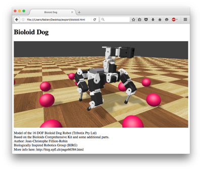
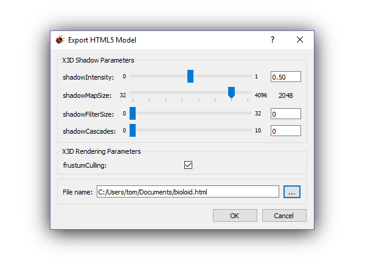

## X3D and Web Scene

### Description

Webots can export a world to an interactive 3D `HTML` page.
This feature is especially useful for publishing Webots-created worlds on the Web.

During the export, a [X3D](http://www.web3d.org/x3d/what-x3d) file and a `HTML5` page are generated.

The `X3D` file contains the graphical information of the world.
`X3D` is a modern `XML`-based file format for representing 3D computer graphics.
It can be imported in many 3D modeling or visualizing applications.

The `HTML5` page contains a Webots player which displays the `X3D` file as shown in the [figure below](#screenshot-of-a-web-scene-page-generated-by-webots).
It can be open in any recent Web browser as documented in the [section below](#remarks-on-the-used-technologies-and-their-limitations).
The 3D navigation in the player is possible using the mouse or the touch screen, similarly to the Webots navigation.

%figure "Screenshot of a Web scene page generated by Webots"



%end

### How to Export a Web Scene

Select the `File / Export HTML5 Model...` menu item, select the desired `X3D` parameters and choose the target `HTML` file in the pop-up dialog.
When the export is completed, Webots will ask to playback the resulting file in the default Web browser.

%figure "The HTML export dialog."

%end

The chosen `X3D` parameters are stored in the [project file](the-standard-file-hierarchy-of-a-project.md#the-project-files) and automatically proposed during the next HTML export.

**Note**: The `X3D` file and the required textures are exported in the same directory as the target `HTML` file.

**Note**: The playback option may not work correctly depending on your default Web browser.
In this case, please refer to the [section below](#remarks-on-the-used-technologies-and-their-limitations).

### How to Embed a Web Scene in Your Website

The exported `HTML` page is designed to be as simple as possible, and is the reference for an integration in an external Website.
Alternatively, an `<iframe>` tag pointing to the generated Webots page is a less elegant but simpler solution.

The resources (`CSS`, `JavaScript`, etc.) on the [Cyberbotics Website](https://www.cyberbotics.com) will be stored for long term, and can be used from an external Website.

### Limitations

All the graphical nodes ([Box](../reference/box.md), [Sphere](../reference/sphere.md), [Appearance](../reference/appearance.md), [Material](../reference/material.md), [ImageTexture](../reference/imagetexture.md), [Light](../reference/light.md), [Transform](../reference/transform.md), etc.) are supported.

The rendering of the Webots player is performed using the [three.js](https://threejs.org/) library.
It may occur that the rendering in the Webots application and in the exported Web page are not strictly equivalent.

### Remarks on the Used Technologies and Their Limitations

The Webots player is using internally the `three.js` library (based on `WebGL`).

`three.js` is supported in recent versions of Firefox, Chrome, Edge, Internet Explorer and Safari on macOS (see details on the [three.js website](https://threejs.org/)).
In case of related issues, make sure that `WebGL` is enabled in your Web browser settings.

### Web Browser Support

Some web browsers (for example Google Chrome and Firefox 68 or later) cannot open local files using the file protocol by default, while this is this is required by the Webots player to open the `X3D` file and the textures.
Here are some workarounds:
- run a local HTTP server in the directory containing the exported files.
    - Python 3:
        ```sh
        python3 -m http.server
        ```
    - Python 2:
        ```sh
        python -m SimpleHTTPServer
        ```
    - NodeJS:
        ```sh
        sudo npm install -g http-server
        http-server
        ```
- disable browser security flags:
    - Chrome: launch with the `--allow-file-access-from-files` option
    - Firefox:
        1. Open Firefox browser and in the address bar type ``about:config``, hit Enter button and click on `I'll be careful, I promise!`.
        2. Search for `privacy.file_unique_origin` or `security.fileuri.strict_origin_policy` options and double click on it to change the status from true to false.
