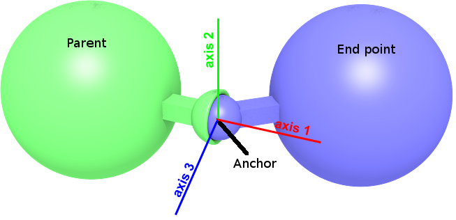

## BallJoint

Derived from [Joint](joint.md).

```
BallJoint {
  SFNode     jointParameters2  NULL   # {JointParameters, PROTO}
  SFNode     jointParameters3  NULL   # {JointParameters, PROTO}
  MFNode     device            [ ]    # {RotationalMotor, PositionSensor, Brake, PROTO}
  MFNode     device2           [ ]    # {RotationalMotor, PositionSensor, Brake, PROTO}
  MFNode     device3           [ ]    # {RotationalMotor, PositionSensor, Brake, PROTO}
  SFFloat    position          0      # [0, inf)
  SFFloat    position2         0      # [0, inf)
  SFFloat    position3         0      # [0, inf)
}
```

### Description

%figure "Ball joint"



%end

The [BallJoint](#balljoint) node can be used to model a ball joint.
A ball joint, also called ball-and-socket, prevents translation motion while allowing rotation around its anchor (3 degrees of freedom).
It supports spring and damping parameters which can be used to simulate the elastic deformation of ropes and flexible beams.

It's 3 perpendicular axes can be controlled independently using [RotationalMotors](rotationalmotor.md).
The axes are defined in the [JointParameters](jointparameters.md) nodes in the `jointParameters2` and `jointParameters3` fields (the third axis is computed automatically to be perpendicular to the two first one).
If the `jointParameters2` and/or `jointParameters3` fields are empty the default axes are defined instead (respectively `(1, 0, 0)` and `(0, 0, 1)`).

### Field Summary

- `jointParameters2` and `jointParameters3`: These fields optionally specify [JointParameters](jointparameters.md) nodes.
They contain, among others, the joint position, the axis position expressed in relative coordinates and the stop positions.
If these fields are empty, the `springConstant`, `dampingConstant` and `staticFriction` are homogeneous along each rotation axes.

- `device`, `device2` and `device3`: These fields optionally specify a [RotationalMotor](rotationalmotor.md), an angular [PositionSensor](positionsensor.md) and/or a [Brake](brake.md) device for each axes.
If no motor is specified, the corresponding axis is passive.
The `minPosition` and `maxPosition` fields of the [RotationalMotor](rotationalmotor.md) in the `device2` field are constraint to the range [-pi/2; pi/2].

- `position`, `position2` and `position3`: These fields are not visible from the Scene Tree, see [joint's hidden position field](joint.md#joints-hidden-position-fields).
